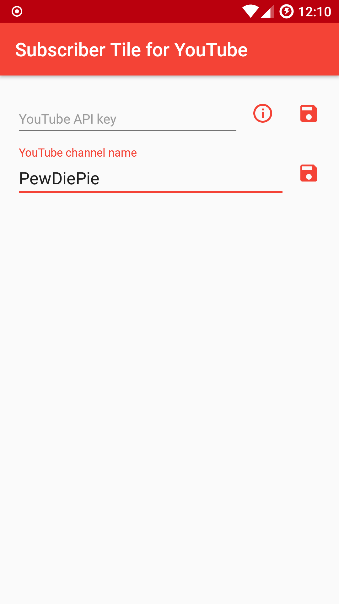
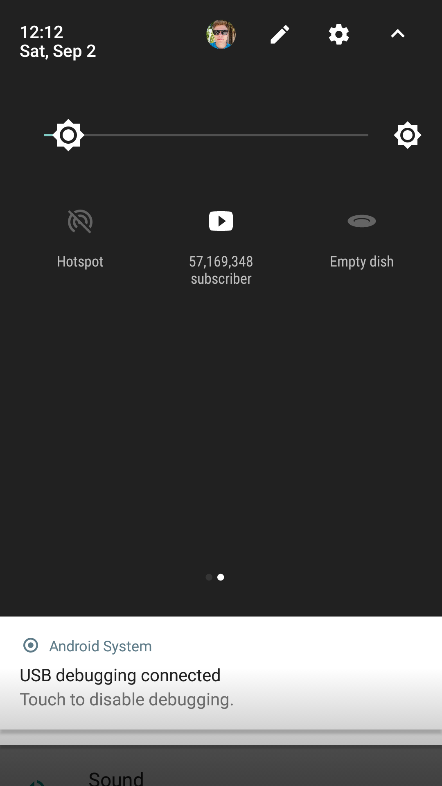

# YouTube Subscriber Count Tile
An android app to display YouTube subscriber count as a Quick Setting Tile.
Follow your favorite YouTube channel and see it rise to the top.

  

This is a simple Android Quick Settings tile introduced in API 24. The app uses the YouTube Data API and uses an API key and the channel name to fetch the subscribers count. The count is then displayed as Quick Settings tile and updated each time the user pulls down the panel or clicks on the icon.
